# RSS data feed.

This project is a webpage, which reads XML data from an external source and compares records with the database.
If new data is found, it gets stored in a database. 

There three options to fetch RSS feed :
    
    1. In webpage, press "Get data" button
    2. From terminal (whithin project folder) type "PHP artisan currencies:fetch"
    3. Using cronjob automated data fetch.
    
 Please follow instructions below to run it on your local environment.
    

    Open terminal within a folder, were you want to download this project.
    Enter command "git clone https://github.com/JanisDavidsons/tet.git ."

   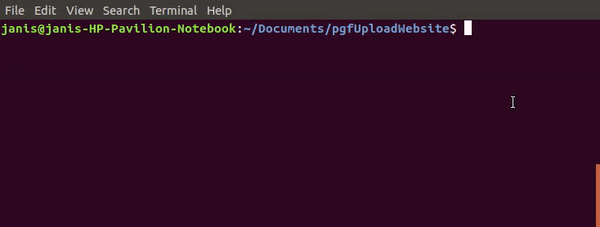

    Install Composer Dependencies.
    "composer install"

   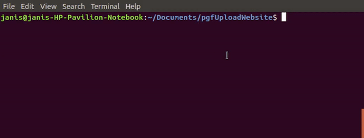

    Install NPM Dependencies.
    "npm install"
    
   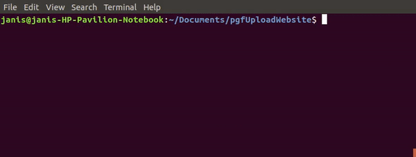

    Create a copy of your .env file.
    "cp .env.example .env"
    
   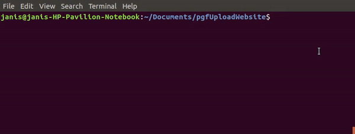

    Generate an app encryption key.
    "php artisan key:generate"
    
   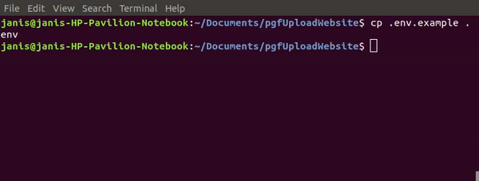

    Create new file in databse folder with command "touch database.sqlite"
    You can use any database, but in this example I`m using sqlite.
    
   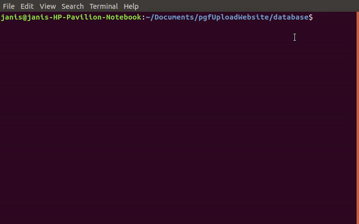

     In the .env file, add database information to allow Laravel to connect to the database.  
     Leave only this part in database section "DB_CONNECTION=sqlite"  

   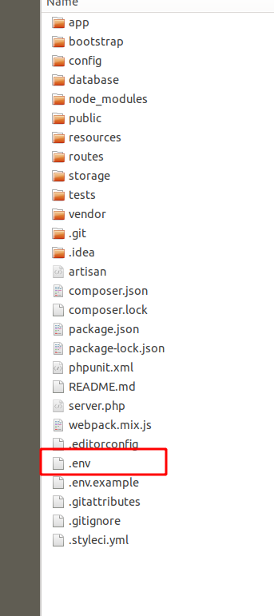
   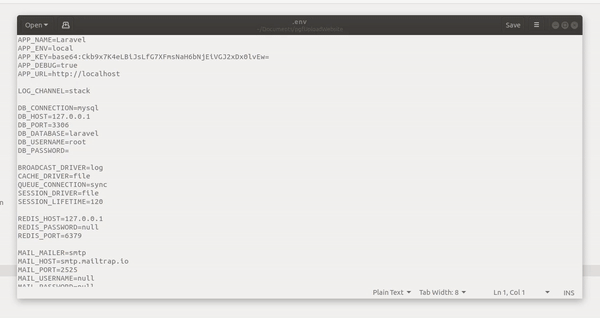

    Migrate the database
   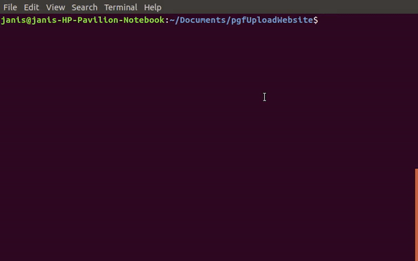
   
     To set up cronjob automated data fetch, locate crontab file like so: 
   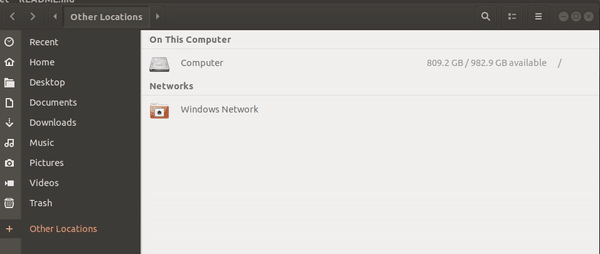
   
     Add this line of code at the end of file: 
   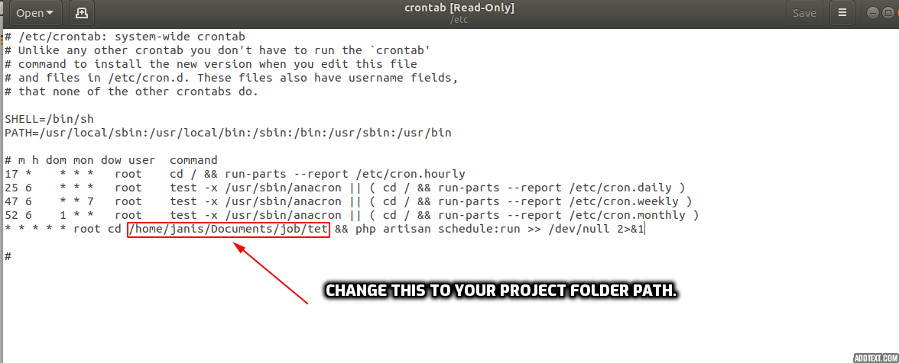
   
    Run local server with command "php artisan serve"
    Open adress displayed in terminal!
   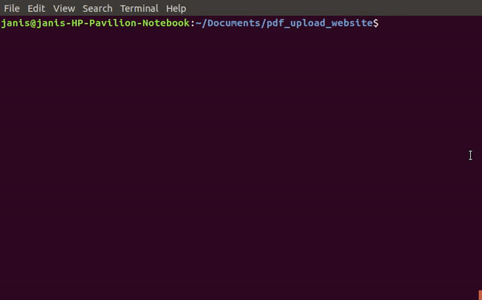
       
          
Sample of the project:

   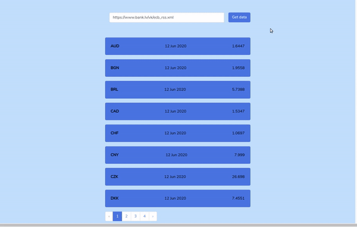
